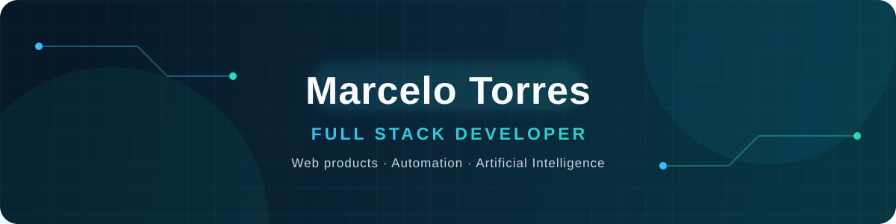

  

## Sobre mim

Desenvolvedor Full Stack de Porto Alegre, focado em transformar problemas de negócio em produtos web simples, confiáveis e fáceis de usar. Trabalho principalmente com **TypeScript, React, Next.js, Python e PostgreSQL**, incluindo automações e recursos apoiados por inteligência artificial.

Atualmente desenvolvo o **Prospect Radar**, uma plataforma para pesquisar, qualificar e priorizar empresas na prospecção comercial B2B.

## Projetos em destaque

| Projeto | O que ele resolve | Tecnologias |
| --- | --- | --- |
| [**Prospect Radar**](https://github.com/marcelotorres82/AutoLead) · [Demo](https://prospect-radar-mu.vercel.app) | Pesquisa, scoring e priorização de empresas para prospecção B2B | Next.js, TypeScript, React, Neon, Drizzle |
| [**PDV Control**](https://github.com/marcelotorres82/PDV-control) · [Demo](https://pdv-control.vercel.app) | Gestão e controle de operações de ponto de venda | Vue, JavaScript |
| [**Consulta CNPJ**](https://github.com/marcelotorres82/consulta_cnpj) · [Demo](https://consultacnpj-cdavsorkdb85j6tvyaxmdz.streamlit.app) | Consulta consolidada de informações empresariais brasileiras | Python, Streamlit, APIs públicas |
| [**Liquid Ledger Craft**](https://github.com/marcelotorres82/liquid-ledger-craft) · [Demo](https://liquid-ledger-craft.vercel.app) | Aplicação web para organização e visualização financeira | JavaScript |

## Tecnologias

---

  Aberto a conexões, colaborações e novos desafios.

